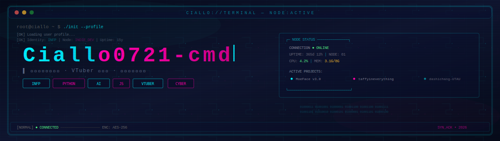

# Ciallo～(∠・ω・)⌒★

<p align="center">
  
</p>

---

<p align="center">
  <a href="https://github.com/ciallo0721-cmd"></a>
  <a href="https://ciallo0721-cmd.top"></a>
  <a href="https://space.bilibili.com/478967440"></a>
</p>

---

```
// ============================================================
//  绫濑雪绪 (Ayase Yukio)
//  ———————————————————————————————————————————
//  A student developer who loves AI, ACGN, and making stuff.
//  INFP · VTuber fan · Cyberpunk enthusiast
// ============================================================
```

```
// == 个人简介 / Profile ==
//
// 在现实和二次元之间反复横跳的脆皮初中生
// 喜欢折腾代码，把想做的稀奇古怪东西都塞进项目里

const me = {
  name:           "绫濑雪绪",
  alias:          "Ayase Yukio",
  username:       "ciallo0721-cmd",
  type:           "INFP-T",
  role:           "student · indie_dev",
  vibe:           "VTuber × AI × Cyberpunk",
  motto:          "做没人做、但有人需要的小东西 — 能跑就行，能跑得好更好",
};
```

---

```
// ============================================================
//  TECH STACK  —  技术栈
// ============================================================

const tech_stack = {
  languages: {
    proficient: ["Python", "JavaScript", "HTML", "CSS"],
    learning:   ["Java", "C++"],
  },

  ai_and_cv: {
    frameworks: ["PyTorch", "OpenCV", "MediaPipe", "FaceNet"],
    applications: ["人脸识别", "关键点检测", "图像分类"],
  },

  web_and_tools: {
    backend:    ["Flask"],
    frontend:   ["Jekyll", "GitHub Pages"],
    cicd:       ["GitHub Actions"],
    other:      ["Git", "LRC (一点点)"],
  },
};
```

---

```
// ============================================================
//  PROJECTS  —  项目列表
// ============================================================

// ——— 主力项目 ———

const featured = [
  {
    name:   "MoeFace",
    desc:   "基于 FaceNet + LBP 的动漫人脸识别系统",
    tech:   "Python · PyTorch · MediaPipe · YOLO",
    feat:   "图片/视频/摄像头实时识别 · 43+角色 2150+特征库",
    status: "🟢 active",
    url:    "https://github.com/ciallo0721-cmd/MoeFace",
  },
  {
    name:   "关注塔菲谢谢喵",
    desc:   "雏草姬应援站（非盈利粉丝站点）",
    tech:   "HTML · JS · CSS",
    url:    "https://xn--d6qr7hrtcb06avk0aljka.top",
    status: "🟢 active",
  },
  {
    name:   "Eras Framework",
    desc:   "AI 智能体框架 — Java 21 + JavaFX 桌面聊天应用",
    tech:   "Java · JavaFX",
    url:    "https://github.com/ciallo0721-cmd/eras-framework",
    status: "🚧 wip",
  },
  {
    name:   "Work-Simulator",
    desc:   "文字打工模拟游戏",
    tech:   "Python",
    url:    "https://github.com/ciallo0721-cmd/Work-Simulator",
    status: "🟢 active",
  },
];

// ——— 网站 & 工具 ———

const tools = [
  {
    name:   "个人博客",
    desc:   "技术 + 二次元 + 心理学随笔（20+ 篇文章）",
    tech:   "HTML · Jekyll",
    url:    "https://ciallo0721-cmd.top",
    status: "🟢 active",
  },
  {
    name:   "scraper",
    desc:   "网页爬虫工具集",
    tech:   "Python",
    url:    "https://github.com/ciallo0721-cmd/scraper",
    status: "🟢 active",
  },
  {
    name:   "acetaffy-prompt",
    desc:   "AI 提示词管理（永雏塔菲特供版）",
    tech:   "Markdown",
    url:    "https://github.com/ciallo0721-cmd/acetaffy-prompt",
    status: "🟢 active",
  },
  {
    name:   "url-masker",
    desc:   "独立密钥、无历史记录的 URL 加密工具",
    tech:   "Python",
    url:    "https://github.com/ciallo0721-cmd/url-masker",
    status: "🟢 active",
  },
];
```

---

```
// ============================================================
//  CONTACT  —  联系方式
// ============================================================

const contact = {
  // 主要
  qq:      "3627742771",
  email:   ["ciallo0721cmd@gmail.com", "nb666mc26@outlook.com"],
  github:  "https://github.com/ciallo0721-cmd",
  bilibili: "https://space.bilibili.com/478967440",
  website: "https://ciallo0721-cmd.top",

  // 社交
  twitter:  "https://x.com/ciallo0721cmd",
  youtube:  "https://youtube.com/@ciallo0721-cmd",
  discord:  "https://discord.gg/fx4N3jg6",
  steam:    "https://steamcommunity.com/profiles/76561199473709076",
  facebook: "https://facebook.com/profile.php?id=61590168321280",
  instagram:"https://instagram.com/moyu0721cmd",
  ifdian:   "https://ifdian.net/a/ciallo0721-cmd",
};
```

---

```
// ============================================================
//  STATUS  —  当前状态
// ============================================================

const status = {
  working_on: [
    "🦴 MoeFace — 人体关键点检测 + 模块化架构",
    "🎮 Eras Framework — Java 21 + JavaFX + AI 智能体",
    "📝 博客持续更新 — 技术 · 二次元 · 心理学",
    "🐙 GitHub 常规 push 节奏",
  ],

  recently_done: [
    "✅ MoeFace v3.0 — EXE 打包 + Whisper 语音识别",
    "✅ VTuber 人格测试 — 3 档难度完整版",
    "✅ Work-Simulator — 文字冒险核心跑通",
    "✅ 仓库整理 — 清理废弃项目",
  ],
};
```

---

---

## 🎵 音乐测试区

### ① iframe 网易云播放器
<iframe frameborder="no" border="0" marginwidth="0" marginheight="0" width=330 height=86 src="//music.163.com/outchain/player?type=2&id=1892579773&auto=1&height=66"></iframe>

### ② 本地 mp3
<audio src="./1.mp3" controls autoplay loop>
  你的浏览器不支持音频标签
</audio>

---

<div align="center">

```
╔══════════════════════════════════════╗
║   Ciallo～(∠・ω・)⌒☆               ║
║   关注永雏塔菲喵！关注永雏塔菲谢谢喵！  ║
╚══════════════════════════════════════╝
```

</div>
